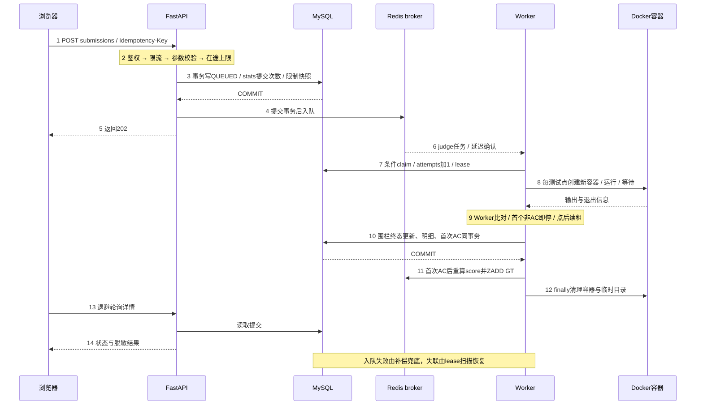

# 提交与判题时序

Mermaid是本图唯一维护源；[v1.1原PNG](reference/submission-sequence-v1.1.png)仅作存档。修正步骤2与正文的校验顺序；重放顺序等W5事项保持原文待复核。

```mermaid
sequenceDiagram
    participant B as 浏览器
    participant A as FastAPI
    participant M as MySQL
    participant R as Redis broker
    participant W as Worker
    participant D as Docker容器
    B->>A: 1 POST submissions / Idempotency-Key
    Note over A: 2 鉴权 → 限流 → 参数校验 → 在途上限
    A->>M: 3 事务写QUEUED / stats提交次数 / 限制快照
    M-->>A: COMMIT
    A->>R: 4 提交事务后入队
    A-->>B: 5 返回202
    R-->>W: 6 judge任务 / 延迟确认
    W->>M: 7 条件claim / attempts加1 / lease
    W->>D: 8 每测试点创建新容器 / 运行 / 等待
    D-->>W: 输出与退出信息
    Note over W: 9 Worker比对 / 首个非AC即停 / 点后续租
    W->>M: 10 围栏终态更新、明细、首次AC同事务
    M-->>W: COMMIT
    W->>R: 11 首次AC后重算score并ZADD GT
    W->>D: 12 finally清理容器与临时目录
    B->>A: 13 退避轮询详情
    A->>M: 读取提交
    A-->>B: 14 状态与脱敏结果
    Note over M,W: 入队失败由补偿兜底，失联由lease扫描恢复
```

隐藏点不返回用户stdout/stderr。attempts、lease、重试和幂等重放的具体边界在11/09—11/11复核，本图不提前裁定。
