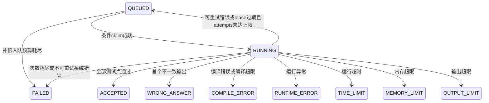

# 提交状态机

Mermaid是本图唯一维护源；[v1.1原PNG](reference/submission-state-v1.1.png)仅作存档。本次只转写既有拓扑，没有新增或删除状态边。

```mermaid
stateDiagram-v2
    QUEUED --> RUNNING: 条件claim成功
    QUEUED --> FAILED: 补偿入队预算耗尽
    RUNNING --> QUEUED: 可重试错误或lease过期且attempts未达上限
    RUNNING --> FAILED: 次数耗尽或不可重试系统错误
    RUNNING --> ACCEPTED: 全部测试点通过
    RUNNING --> WRONG_ANSWER: 首个不一致输出
    RUNNING --> COMPILE_ERROR: 编译错误或编译超限
    RUNNING --> RUNTIME_ERROR: 运行异常
    RUNNING --> TIME_LIMIT: 运行超时
    RUNNING --> MEMORY_LIMIT: 内存超限
    RUNNING --> OUTPUT_LIMIT: 输出超限
```

所有终态不再改变；状态变更带前置条件。lease过期语义、续租/接管条件和重试门槛仍按原设计保留到W5专项复核，不能把此图当作新增的实现裁决。
